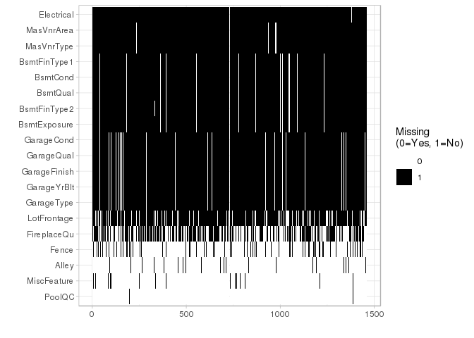
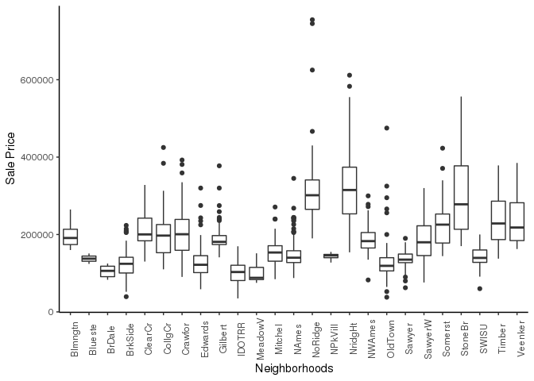
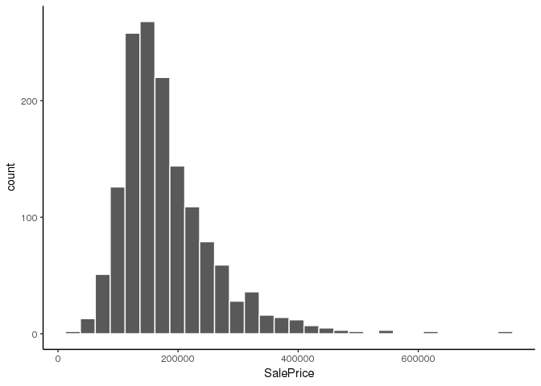
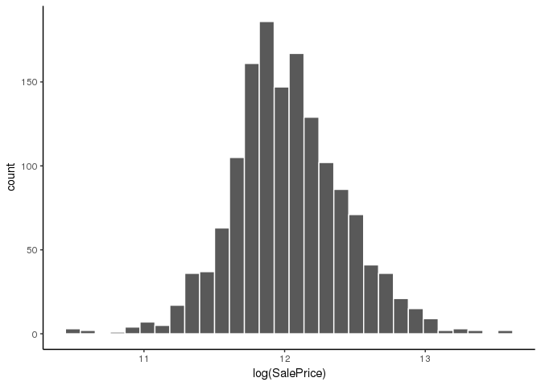

EDA Walkthrough
================

Exploratory Data Analysis (EDA) refers to the critical process of performing initial investigations on data so as to discover patterns,to spot anomalies,to test hypothesis and to check assumptions with the help of summary statistics and graphical representations. \[Source: <https://towardsdatascience.com/exploratory-data-analysis-8fc1cb20fd15>\]

Loading libraries
-----------------

``` r
load.libraries <- c('data.table', 'corrplot', 'ggplot2', 'e1071', 'dplyr' , 'gridExtra', 'scales')
install.lib <- load.libraries[!load.libraries %in% installed.packages()]
for(libs in install.lib) install.packages(libs, dependences = TRUE)
sapply(load.libraries, require, character = TRUE)
```

    ## Loading required package: data.table

    ## Loading required package: corrplot

    ## corrplot 0.84 loaded

    ## Loading required package: ggplot2

    ## Loading required package: e1071

    ## Loading required package: dplyr

    ## 
    ## Attaching package: 'dplyr'

    ## The following objects are masked from 'package:data.table':
    ## 
    ##     between, first, last

    ## The following objects are masked from 'package:stats':
    ## 
    ##     filter, lag

    ## The following objects are masked from 'package:base':
    ## 
    ##     intersect, setdiff, setequal, union

    ## Loading required package: gridExtra

    ## 
    ## Attaching package: 'gridExtra'

    ## The following object is masked from 'package:dplyr':
    ## 
    ##     combine

    ## Loading required package: scales

    ## data.table   corrplot    ggplot2      e1071      dplyr  gridExtra 
    ##       TRUE       TRUE       TRUE       TRUE       TRUE       TRUE 
    ##     scales 
    ##       TRUE

Importing and reading dataset
-----------------------------

``` r
data <- read.csv("~/R/Github/Kaggle-Ames-Housing-Prices/data/train.csv")

# Take a look at the first few rows of the data
head(data)
```

    ##   Id MSSubClass MSZoning LotFrontage LotArea Street Alley LotShape
    ## 1  1         60       RL          65    8450   Pave  <NA>      Reg
    ## 2  2         20       RL          80    9600   Pave  <NA>      Reg
    ## 3  3         60       RL          68   11250   Pave  <NA>      IR1
    ## 4  4         70       RL          60    9550   Pave  <NA>      IR1
    ## 5  5         60       RL          84   14260   Pave  <NA>      IR1
    ## 6  6         50       RL          85   14115   Pave  <NA>      IR1
    ##   LandContour Utilities LotConfig LandSlope Neighborhood Condition1
    ## 1         Lvl    AllPub    Inside       Gtl      CollgCr       Norm
    ## 2         Lvl    AllPub       FR2       Gtl      Veenker      Feedr
    ## 3         Lvl    AllPub    Inside       Gtl      CollgCr       Norm
    ## 4         Lvl    AllPub    Corner       Gtl      Crawfor       Norm
    ## 5         Lvl    AllPub       FR2       Gtl      NoRidge       Norm
    ## 6         Lvl    AllPub    Inside       Gtl      Mitchel       Norm
    ##   Condition2 BldgType HouseStyle OverallQual OverallCond YearBuilt
    ## 1       Norm     1Fam     2Story           7           5      2003
    ## 2       Norm     1Fam     1Story           6           8      1976
    ## 3       Norm     1Fam     2Story           7           5      2001
    ## 4       Norm     1Fam     2Story           7           5      1915
    ## 5       Norm     1Fam     2Story           8           5      2000
    ## 6       Norm     1Fam     1.5Fin           5           5      1993
    ##   YearRemodAdd RoofStyle RoofMatl Exterior1st Exterior2nd MasVnrType
    ## 1         2003     Gable  CompShg     VinylSd     VinylSd    BrkFace
    ## 2         1976     Gable  CompShg     MetalSd     MetalSd       None
    ## 3         2002     Gable  CompShg     VinylSd     VinylSd    BrkFace
    ## 4         1970     Gable  CompShg     Wd Sdng     Wd Shng       None
    ## 5         2000     Gable  CompShg     VinylSd     VinylSd    BrkFace
    ## 6         1995     Gable  CompShg     VinylSd     VinylSd       None
    ##   MasVnrArea ExterQual ExterCond Foundation BsmtQual BsmtCond BsmtExposure
    ## 1        196        Gd        TA      PConc       Gd       TA           No
    ## 2          0        TA        TA     CBlock       Gd       TA           Gd
    ## 3        162        Gd        TA      PConc       Gd       TA           Mn
    ## 4          0        TA        TA     BrkTil       TA       Gd           No
    ## 5        350        Gd        TA      PConc       Gd       TA           Av
    ## 6          0        TA        TA       Wood       Gd       TA           No
    ##   BsmtFinType1 BsmtFinSF1 BsmtFinType2 BsmtFinSF2 BsmtUnfSF TotalBsmtSF
    ## 1          GLQ        706          Unf          0       150         856
    ## 2          ALQ        978          Unf          0       284        1262
    ## 3          GLQ        486          Unf          0       434         920
    ## 4          ALQ        216          Unf          0       540         756
    ## 5          GLQ        655          Unf          0       490        1145
    ## 6          GLQ        732          Unf          0        64         796
    ##   Heating HeatingQC CentralAir Electrical X1stFlrSF X2ndFlrSF LowQualFinSF
    ## 1    GasA        Ex          Y      SBrkr       856       854            0
    ## 2    GasA        Ex          Y      SBrkr      1262         0            0
    ## 3    GasA        Ex          Y      SBrkr       920       866            0
    ## 4    GasA        Gd          Y      SBrkr       961       756            0
    ## 5    GasA        Ex          Y      SBrkr      1145      1053            0
    ## 6    GasA        Ex          Y      SBrkr       796       566            0
    ##   GrLivArea BsmtFullBath BsmtHalfBath FullBath HalfBath BedroomAbvGr
    ## 1      1710            1            0        2        1            3
    ## 2      1262            0            1        2        0            3
    ## 3      1786            1            0        2        1            3
    ## 4      1717            1            0        1        0            3
    ## 5      2198            1            0        2        1            4
    ## 6      1362            1            0        1        1            1
    ##   KitchenAbvGr KitchenQual TotRmsAbvGrd Functional Fireplaces FireplaceQu
    ## 1            1          Gd            8        Typ          0        <NA>
    ## 2            1          TA            6        Typ          1          TA
    ## 3            1          Gd            6        Typ          1          TA
    ## 4            1          Gd            7        Typ          1          Gd
    ## 5            1          Gd            9        Typ          1          TA
    ## 6            1          TA            5        Typ          0        <NA>
    ##   GarageType GarageYrBlt GarageFinish GarageCars GarageArea GarageQual
    ## 1     Attchd        2003          RFn          2        548         TA
    ## 2     Attchd        1976          RFn          2        460         TA
    ## 3     Attchd        2001          RFn          2        608         TA
    ## 4     Detchd        1998          Unf          3        642         TA
    ## 5     Attchd        2000          RFn          3        836         TA
    ## 6     Attchd        1993          Unf          2        480         TA
    ##   GarageCond PavedDrive WoodDeckSF OpenPorchSF EnclosedPorch X3SsnPorch
    ## 1         TA          Y          0          61             0          0
    ## 2         TA          Y        298           0             0          0
    ## 3         TA          Y          0          42             0          0
    ## 4         TA          Y          0          35           272          0
    ## 5         TA          Y        192          84             0          0
    ## 6         TA          Y         40          30             0        320
    ##   ScreenPorch PoolArea PoolQC Fence MiscFeature MiscVal MoSold YrSold
    ## 1           0        0   <NA>  <NA>        <NA>       0      2   2008
    ## 2           0        0   <NA>  <NA>        <NA>       0      5   2007
    ## 3           0        0   <NA>  <NA>        <NA>       0      9   2008
    ## 4           0        0   <NA>  <NA>        <NA>       0      2   2006
    ## 5           0        0   <NA>  <NA>        <NA>       0     12   2008
    ## 6           0        0   <NA> MnPrv        Shed     700     10   2009
    ##   SaleType SaleCondition SalePrice
    ## 1       WD        Normal    208500
    ## 2       WD        Normal    181500
    ## 3       WD        Normal    223500
    ## 4       WD       Abnorml    140000
    ## 5       WD        Normal    250000
    ## 6       WD        Normal    143000

``` r
# Dimensions of data
cat('Data has', dim(data)[1], 'rows and', dim(data)[2], 'columns.')
```

    ## Data has 1460 rows and 81 columns.

``` r
# So, we have 1460 rows and 81 columns. There is one dependent variable (Sales Price) and 80 independent variables. 
#We can observe that there are a lot of features in this dataset and we would require feature extraction technique. 

# Now, let's observe the structure of the dataset
str(data)
```

    ## 'data.frame':    1460 obs. of  81 variables:
    ##  $ Id           : int  1 2 3 4 5 6 7 8 9 10 ...
    ##  $ MSSubClass   : int  60 20 60 70 60 50 20 60 50 190 ...
    ##  $ MSZoning     : Factor w/ 5 levels "C (all)","FV",..: 4 4 4 4 4 4 4 4 5 4 ...
    ##  $ LotFrontage  : int  65 80 68 60 84 85 75 NA 51 50 ...
    ##  $ LotArea      : int  8450 9600 11250 9550 14260 14115 10084 10382 6120 7420 ...
    ##  $ Street       : Factor w/ 2 levels "Grvl","Pave": 2 2 2 2 2 2 2 2 2 2 ...
    ##  $ Alley        : Factor w/ 2 levels "Grvl","Pave": NA NA NA NA NA NA NA NA NA NA ...
    ##  $ LotShape     : Factor w/ 4 levels "IR1","IR2","IR3",..: 4 4 1 1 1 1 4 1 4 4 ...
    ##  $ LandContour  : Factor w/ 4 levels "Bnk","HLS","Low",..: 4 4 4 4 4 4 4 4 4 4 ...
    ##  $ Utilities    : Factor w/ 2 levels "AllPub","NoSeWa": 1 1 1 1 1 1 1 1 1 1 ...
    ##  $ LotConfig    : Factor w/ 5 levels "Corner","CulDSac",..: 5 3 5 1 3 5 5 1 5 1 ...
    ##  $ LandSlope    : Factor w/ 3 levels "Gtl","Mod","Sev": 1 1 1 1 1 1 1 1 1 1 ...
    ##  $ Neighborhood : Factor w/ 25 levels "Blmngtn","Blueste",..: 6 25 6 7 14 12 21 17 18 4 ...
    ##  $ Condition1   : Factor w/ 9 levels "Artery","Feedr",..: 3 2 3 3 3 3 3 5 1 1 ...
    ##  $ Condition2   : Factor w/ 8 levels "Artery","Feedr",..: 3 3 3 3 3 3 3 3 3 1 ...
    ##  $ BldgType     : Factor w/ 5 levels "1Fam","2fmCon",..: 1 1 1 1 1 1 1 1 1 2 ...
    ##  $ HouseStyle   : Factor w/ 8 levels "1.5Fin","1.5Unf",..: 6 3 6 6 6 1 3 6 1 2 ...
    ##  $ OverallQual  : int  7 6 7 7 8 5 8 7 7 5 ...
    ##  $ OverallCond  : int  5 8 5 5 5 5 5 6 5 6 ...
    ##  $ YearBuilt    : int  2003 1976 2001 1915 2000 1993 2004 1973 1931 1939 ...
    ##  $ YearRemodAdd : int  2003 1976 2002 1970 2000 1995 2005 1973 1950 1950 ...
    ##  $ RoofStyle    : Factor w/ 6 levels "Flat","Gable",..: 2 2 2 2 2 2 2 2 2 2 ...
    ##  $ RoofMatl     : Factor w/ 8 levels "ClyTile","CompShg",..: 2 2 2 2 2 2 2 2 2 2 ...
    ##  $ Exterior1st  : Factor w/ 15 levels "AsbShng","AsphShn",..: 13 9 13 14 13 13 13 7 4 9 ...
    ##  $ Exterior2nd  : Factor w/ 16 levels "AsbShng","AsphShn",..: 14 9 14 16 14 14 14 7 16 9 ...
    ##  $ MasVnrType   : Factor w/ 4 levels "BrkCmn","BrkFace",..: 2 3 2 3 2 3 4 4 3 3 ...
    ##  $ MasVnrArea   : int  196 0 162 0 350 0 186 240 0 0 ...
    ##  $ ExterQual    : Factor w/ 4 levels "Ex","Fa","Gd",..: 3 4 3 4 3 4 3 4 4 4 ...
    ##  $ ExterCond    : Factor w/ 5 levels "Ex","Fa","Gd",..: 5 5 5 5 5 5 5 5 5 5 ...
    ##  $ Foundation   : Factor w/ 6 levels "BrkTil","CBlock",..: 3 2 3 1 3 6 3 2 1 1 ...
    ##  $ BsmtQual     : Factor w/ 4 levels "Ex","Fa","Gd",..: 3 3 3 4 3 3 1 3 4 4 ...
    ##  $ BsmtCond     : Factor w/ 4 levels "Fa","Gd","Po",..: 4 4 4 2 4 4 4 4 4 4 ...
    ##  $ BsmtExposure : Factor w/ 4 levels "Av","Gd","Mn",..: 4 2 3 4 1 4 1 3 4 4 ...
    ##  $ BsmtFinType1 : Factor w/ 6 levels "ALQ","BLQ","GLQ",..: 3 1 3 1 3 3 3 1 6 3 ...
    ##  $ BsmtFinSF1   : int  706 978 486 216 655 732 1369 859 0 851 ...
    ##  $ BsmtFinType2 : Factor w/ 6 levels "ALQ","BLQ","GLQ",..: 6 6 6 6 6 6 6 2 6 6 ...
    ##  $ BsmtFinSF2   : int  0 0 0 0 0 0 0 32 0 0 ...
    ##  $ BsmtUnfSF    : int  150 284 434 540 490 64 317 216 952 140 ...
    ##  $ TotalBsmtSF  : int  856 1262 920 756 1145 796 1686 1107 952 991 ...
    ##  $ Heating      : Factor w/ 6 levels "Floor","GasA",..: 2 2 2 2 2 2 2 2 2 2 ...
    ##  $ HeatingQC    : Factor w/ 5 levels "Ex","Fa","Gd",..: 1 1 1 3 1 1 1 1 3 1 ...
    ##  $ CentralAir   : Factor w/ 2 levels "N","Y": 2 2 2 2 2 2 2 2 2 2 ...
    ##  $ Electrical   : Factor w/ 5 levels "FuseA","FuseF",..: 5 5 5 5 5 5 5 5 2 5 ...
    ##  $ X1stFlrSF    : int  856 1262 920 961 1145 796 1694 1107 1022 1077 ...
    ##  $ X2ndFlrSF    : int  854 0 866 756 1053 566 0 983 752 0 ...
    ##  $ LowQualFinSF : int  0 0 0 0 0 0 0 0 0 0 ...
    ##  $ GrLivArea    : int  1710 1262 1786 1717 2198 1362 1694 2090 1774 1077 ...
    ##  $ BsmtFullBath : int  1 0 1 1 1 1 1 1 0 1 ...
    ##  $ BsmtHalfBath : int  0 1 0 0 0 0 0 0 0 0 ...
    ##  $ FullBath     : int  2 2 2 1 2 1 2 2 2 1 ...
    ##  $ HalfBath     : int  1 0 1 0 1 1 0 1 0 0 ...
    ##  $ BedroomAbvGr : int  3 3 3 3 4 1 3 3 2 2 ...
    ##  $ KitchenAbvGr : int  1 1 1 1 1 1 1 1 2 2 ...
    ##  $ KitchenQual  : Factor w/ 4 levels "Ex","Fa","Gd",..: 3 4 3 3 3 4 3 4 4 4 ...
    ##  $ TotRmsAbvGrd : int  8 6 6 7 9 5 7 7 8 5 ...
    ##  $ Functional   : Factor w/ 7 levels "Maj1","Maj2",..: 7 7 7 7 7 7 7 7 3 7 ...
    ##  $ Fireplaces   : int  0 1 1 1 1 0 1 2 2 2 ...
    ##  $ FireplaceQu  : Factor w/ 5 levels "Ex","Fa","Gd",..: NA 5 5 3 5 NA 3 5 5 5 ...
    ##  $ GarageType   : Factor w/ 6 levels "2Types","Attchd",..: 2 2 2 6 2 2 2 2 6 2 ...
    ##  $ GarageYrBlt  : int  2003 1976 2001 1998 2000 1993 2004 1973 1931 1939 ...
    ##  $ GarageFinish : Factor w/ 3 levels "Fin","RFn","Unf": 2 2 2 3 2 3 2 2 3 2 ...
    ##  $ GarageCars   : int  2 2 2 3 3 2 2 2 2 1 ...
    ##  $ GarageArea   : int  548 460 608 642 836 480 636 484 468 205 ...
    ##  $ GarageQual   : Factor w/ 5 levels "Ex","Fa","Gd",..: 5 5 5 5 5 5 5 5 2 3 ...
    ##  $ GarageCond   : Factor w/ 5 levels "Ex","Fa","Gd",..: 5 5 5 5 5 5 5 5 5 5 ...
    ##  $ PavedDrive   : Factor w/ 3 levels "N","P","Y": 3 3 3 3 3 3 3 3 3 3 ...
    ##  $ WoodDeckSF   : int  0 298 0 0 192 40 255 235 90 0 ...
    ##  $ OpenPorchSF  : int  61 0 42 35 84 30 57 204 0 4 ...
    ##  $ EnclosedPorch: int  0 0 0 272 0 0 0 228 205 0 ...
    ##  $ X3SsnPorch   : int  0 0 0 0 0 320 0 0 0 0 ...
    ##  $ ScreenPorch  : int  0 0 0 0 0 0 0 0 0 0 ...
    ##  $ PoolArea     : int  0 0 0 0 0 0 0 0 0 0 ...
    ##  $ PoolQC       : Factor w/ 3 levels "Ex","Fa","Gd": NA NA NA NA NA NA NA NA NA NA ...
    ##  $ Fence        : Factor w/ 4 levels "GdPrv","GdWo",..: NA NA NA NA NA 3 NA NA NA NA ...
    ##  $ MiscFeature  : Factor w/ 4 levels "Gar2","Othr",..: NA NA NA NA NA 3 NA 3 NA NA ...
    ##  $ MiscVal      : int  0 0 0 0 0 700 0 350 0 0 ...
    ##  $ MoSold       : int  2 5 9 2 12 10 8 11 4 1 ...
    ##  $ YrSold       : int  2008 2007 2008 2006 2008 2009 2007 2009 2008 2008 ...
    ##  $ SaleType     : Factor w/ 9 levels "COD","Con","ConLD",..: 9 9 9 9 9 9 9 9 9 9 ...
    ##  $ SaleCondition: Factor w/ 6 levels "Abnorml","AdjLand",..: 5 5 5 1 5 5 5 5 1 5 ...
    ##  $ SalePrice    : int  208500 181500 223500 140000 250000 143000 307000 200000 129900 118000 ...

``` r
# Variable segregation 

#factor variables
cat_var <- names(data)[which(sapply(data, is.factor))]
#numeric variablesdata
num_var <- names(data)[which(sapply(data, is.numeric))]

# Summary of the dataset gives us important insights for numerical var
summary(data[which(sapply(data, is.factor))])
```

    ##     MSZoning     Street      Alley      LotShape  LandContour
    ##  C (all):  10   Grvl:   6   Grvl:  50   IR1:484   Bnk:  63   
    ##  FV     :  65   Pave:1454   Pave:  41   IR2: 41   HLS:  50   
    ##  RH     :  16               NA's:1369   IR3: 10   Low:  36   
    ##  RL     :1151                           Reg:925   Lvl:1311   
    ##  RM     : 218                                                
    ##                                                              
    ##                                                              
    ##   Utilities      LotConfig    LandSlope   Neighborhood   Condition1  
    ##  AllPub:1459   Corner : 263   Gtl:1382   NAmes  :225   Norm   :1260  
    ##  NoSeWa:   1   CulDSac:  94   Mod:  65   CollgCr:150   Feedr  :  81  
    ##                FR2    :  47   Sev:  13   OldTown:113   Artery :  48  
    ##                FR3    :   4              Edwards:100   RRAn   :  26  
    ##                Inside :1052              Somerst: 86   PosN   :  19  
    ##                                          Gilbert: 79   RRAe   :  11  
    ##                                          (Other):707   (Other):  15  
    ##    Condition2     BldgType      HouseStyle    RoofStyle       RoofMatl   
    ##  Norm   :1445   1Fam  :1220   1Story :726   Flat   :  13   CompShg:1434  
    ##  Feedr  :   6   2fmCon:  31   2Story :445   Gable  :1141   Tar&Grv:  11  
    ##  Artery :   2   Duplex:  52   1.5Fin :154   Gambrel:  11   WdShngl:   6  
    ##  PosN   :   2   Twnhs :  43   SLvl   : 65   Hip    : 286   WdShake:   5  
    ##  RRNn   :   2   TwnhsE: 114   SFoyer : 37   Mansard:   7   ClyTile:   1  
    ##  PosA   :   1                 1.5Unf : 14   Shed   :   2   Membran:   1  
    ##  (Other):   2                 (Other): 19                  (Other):   2  
    ##   Exterior1st   Exterior2nd    MasVnrType  ExterQual ExterCond
    ##  VinylSd:515   VinylSd:504   BrkCmn : 15   Ex: 52    Ex:   3  
    ##  HdBoard:222   MetalSd:214   BrkFace:445   Fa: 14    Fa:  28  
    ##  MetalSd:220   HdBoard:207   None   :864   Gd:488    Gd: 146  
    ##  Wd Sdng:206   Wd Sdng:197   Stone  :128   TA:906    Po:   1  
    ##  Plywood:108   Plywood:142   NA's   :  8             TA:1282  
    ##  CemntBd: 61   CmentBd: 60                                    
    ##  (Other):128   (Other):136                                    
    ##   Foundation  BsmtQual   BsmtCond    BsmtExposure BsmtFinType1
    ##  BrkTil:146   Ex  :121   Fa  :  45   Av  :221     ALQ :220    
    ##  CBlock:634   Fa  : 35   Gd  :  65   Gd  :134     BLQ :148    
    ##  PConc :647   Gd  :618   Po  :   2   Mn  :114     GLQ :418    
    ##  Slab  : 24   TA  :649   TA  :1311   No  :953     LwQ : 74    
    ##  Stone :  6   NA's: 37   NA's:  37   NA's: 38     Rec :133    
    ##  Wood  :  3                                       Unf :430    
    ##                                                   NA's: 37    
    ##  BsmtFinType2  Heating     HeatingQC CentralAir Electrical   KitchenQual
    ##  ALQ :  19    Floor:   1   Ex:741    N:  95     FuseA:  94   Ex:100     
    ##  BLQ :  33    GasA :1428   Fa: 49    Y:1365     FuseF:  27   Fa: 39     
    ##  GLQ :  14    GasW :  18   Gd:241               FuseP:   3   Gd:586     
    ##  LwQ :  46    Grav :   7   Po:  1               Mix  :   1   TA:735     
    ##  Rec :  54    OthW :   2   TA:428               SBrkr:1334              
    ##  Unf :1256    Wall :   4                        NA's :   1              
    ##  NA's:  38                                                              
    ##  Functional  FireplaceQu   GarageType  GarageFinish GarageQual 
    ##  Maj1:  14   Ex  : 24    2Types :  6   Fin :352     Ex  :   3  
    ##  Maj2:   5   Fa  : 33    Attchd :870   RFn :422     Fa  :  48  
    ##  Min1:  31   Gd  :380    Basment: 19   Unf :605     Gd  :  14  
    ##  Min2:  34   Po  : 20    BuiltIn: 88   NA's: 81     Po  :   3  
    ##  Mod :  15   TA  :313    CarPort:  9                TA  :1311  
    ##  Sev :   1   NA's:690    Detchd :387                NA's:  81  
    ##  Typ :1360               NA's   : 81                           
    ##  GarageCond  PavedDrive  PoolQC       Fence      MiscFeature
    ##  Ex  :   2   N:  90     Ex  :   2   GdPrv:  59   Gar2:   2  
    ##  Fa  :  35   P:  30     Fa  :   2   GdWo :  54   Othr:   2  
    ##  Gd  :   9   Y:1340     Gd  :   3   MnPrv: 157   Shed:  49  
    ##  Po  :   7              NA's:1453   MnWw :  11   TenC:   1  
    ##  TA  :1326                          NA's :1179   NA's:1406  
    ##  NA's:  81                                                  
    ##                                                             
    ##     SaleType    SaleCondition 
    ##  WD     :1267   Abnorml: 101  
    ##  New    : 122   AdjLand:   4  
    ##  COD    :  43   Alloca :  12  
    ##  ConLD  :   9   Family :  20  
    ##  ConLI  :   5   Normal :1198  
    ##  ConLw  :   5   Partial: 125  
    ##  (Other):   9

``` r
# Checking for NAs in the dataset
colSums(sapply(data, is.na))
```

    ##            Id    MSSubClass      MSZoning   LotFrontage       LotArea 
    ##             0             0             0           259             0 
    ##        Street         Alley      LotShape   LandContour     Utilities 
    ##             0          1369             0             0             0 
    ##     LotConfig     LandSlope  Neighborhood    Condition1    Condition2 
    ##             0             0             0             0             0 
    ##      BldgType    HouseStyle   OverallQual   OverallCond     YearBuilt 
    ##             0             0             0             0             0 
    ##  YearRemodAdd     RoofStyle      RoofMatl   Exterior1st   Exterior2nd 
    ##             0             0             0             0             0 
    ##    MasVnrType    MasVnrArea     ExterQual     ExterCond    Foundation 
    ##             8             8             0             0             0 
    ##      BsmtQual      BsmtCond  BsmtExposure  BsmtFinType1    BsmtFinSF1 
    ##            37            37            38            37             0 
    ##  BsmtFinType2    BsmtFinSF2     BsmtUnfSF   TotalBsmtSF       Heating 
    ##            38             0             0             0             0 
    ##     HeatingQC    CentralAir    Electrical     X1stFlrSF     X2ndFlrSF 
    ##             0             0             1             0             0 
    ##  LowQualFinSF     GrLivArea  BsmtFullBath  BsmtHalfBath      FullBath 
    ##             0             0             0             0             0 
    ##      HalfBath  BedroomAbvGr  KitchenAbvGr   KitchenQual  TotRmsAbvGrd 
    ##             0             0             0             0             0 
    ##    Functional    Fireplaces   FireplaceQu    GarageType   GarageYrBlt 
    ##             0             0           690            81            81 
    ##  GarageFinish    GarageCars    GarageArea    GarageQual    GarageCond 
    ##            81             0             0            81            81 
    ##    PavedDrive    WoodDeckSF   OpenPorchSF EnclosedPorch    X3SsnPorch 
    ##             0             0             0             0             0 
    ##   ScreenPorch      PoolArea        PoolQC         Fence   MiscFeature 
    ##             0             0          1453          1179          1406 
    ##       MiscVal        MoSold        YrSold      SaleType SaleCondition 
    ##             0             0             0             0             0 
    ##     SalePrice 
    ##             0

``` r
# The percentage of data missing in train.
sum(is.na(data)) / (nrow(data) *ncol(data))
```

    ## [1] 0.05889565

``` r
# Check for duplicated rows.
cat("The number of duplicated rows are", nrow(data) - nrow(unique(data)))
```

    ## The number of duplicated rows are 0

Visualizing missing values
--------------------------

``` r
plot_Missing <- function(data_in, title = NULL){
  temp_df <- as.data.frame(ifelse(is.na(data_in), 0, 1))
  temp_df <- temp_df[,order(colSums(temp_df))]
  data_temp <- expand.grid(list(x = 1:nrow(temp_df), y = colnames(temp_df)))
  data_temp$m <- as.vector(as.matrix(temp_df))
  data_temp <- data.frame(x = unlist(data_temp$x), y = unlist(data_temp$y), m = unlist(data_temp$m))
  ggplot(data_temp) + geom_tile(aes(x=x, y=y, fill=factor(m))) + scale_fill_manual(values=c("white", "black"), name="Missing\n(0=Yes, 1=No)") + theme_light() + ylab("") + xlab("") + ggtitle(title)
}


plot_Missing(data[,colSums(is.na(data)) > 0])
```



Plots for categorical variables
-------------------------------

``` r
data_cat <- data[ ,which((names(data) %in% cat_var)==TRUE)]

#fucntion for plotting Histograms
plotHist <- function(data_in, i) {
  data <- data.frame(x=data_in[[i]])
  p <- ggplot(data=data, aes(x=factor(x))) + stat_count() + xlab(colnames(data_in)[i]) + theme_classic() + 
    theme(axis.text.x = element_text(angle = 90, hjust =1))
  return (p)
}

#arranging plots
doPlots <- function(data_in, fun, ii, ncol=3) {
  pp <- list()
  for (i in ii) {
    p <- fun(data_in=data_in, i=i)
    pp <- c(pp, list(p))
  }
  do.call("grid.arrange", c(pp, ncol=ncol))
}

doPlots(data_cat, fun= plotHist, ii= 1:4, ncol =2 )
```


``` r
doPlots(data_cat, fun= plotHist, ii= 5:8, ncol =2 )
```


``` r
doPlots(data_cat, fun= plotHist, ii= 9:12, ncol =2 )
```


``` r
doPlots(data_cat, fun= plotHist, ii= 13:16, ncol =2 )
```


``` r
doPlots(data_cat, fun= plotHist, ii= 17:20, ncol =2 )
```


``` r
doPlots(data_cat, fun= plotHist, ii= 21:24, ncol =2 )
```


``` r
doPlots(data_cat, fun= plotHist, ii= 25:28, ncol =2 )
```


Prices of sales in every Neighborhood
-------------------------------------

``` r
#to avoid exponential notation
options(scipen=5)

ggplot(data,aes(Neighborhood, SalePrice)) + geom_boxplot() + theme_classic() +
  theme(axis.text.x = element_text(angle = 90)) + xlab('Neighborhoods') + ylab('Sale Price')
```



Plots for numerical variables
-----------------------------

``` r
data_num <- data[ ,which((names(data) %in% num_var)==TRUE)]

#denisty plots for numerical variables
plotDen <- function(data_in, i){
  data <- data.frame(x=data_in[[i]], SalePrice = data_in$SalePrice)
  p <- ggplot(data= data) + geom_line(aes(x = x), stat = 'density', size = 1,alpha = 1.0) +
    xlab(paste0((colnames(data_in)[i]), '\n', 'Skewness: ',round(skewness(data_in[[i]], na.rm = TRUE), 2))) + theme_classic() 
  return(p)
   
}

doPlots(data_num, fun = plotDen, ii = 2:6, ncol = 2)
```

    ## Warning: Removed 259 rows containing non-finite values (stat_density).


``` r
doPlots(data_num, fun = plotDen, ii = 7:12, ncol = 2)
```

    ## Warning: Removed 8 rows containing non-finite values (stat_density).


``` r
doPlots(data_num, fun = plotDen, ii = 13:17, ncol = 2)
```


Correaltion
-----------

Dark blue shades represents positive correlation while dark red shades represents negative correlation. After correlations plot we observe that the following variables are highly correlated to Sales price.

OverallQual : Rates the overall material and finish of the house : Factor with 10 levels YearBuilt : Original construction date : Discrete Numeric / Factor YearRemodAdd : Remodel date (same as construction date if no remodeling or additions) : Discrete Numeric / Factor TotalBsmtSF : Total square feet of basement area : Numeric X1stFlrSF : First Floor square feet : Numeric GrLivArea : Above grade (ground) living area square feet : Numeric FullBath : Full bathrooms above grade : Numeric / Factor TotRmsAbvGrd : Total rooms above grade (does not include bathrooms) : Discrete Numeric / Factor GarageYrBlt : Year garage was built : Numeric GarageCars : Size of garage in car capacity : Discrete Numeric / Factor GarageArea : Size of garage in square feet : Numeric

``` r
correlations <- cor(na.omit(data_num[,-1]))

# correlations
row_indic <- apply(correlations, 1, function(x) sum(x > 0.3 | x < -0.3) > 1)

correlations<- correlations[row_indic ,row_indic ]
corrplot(correlations, method="square")
```


``` r
plotCorr <- function(data_in, i){
  data <- data.frame(x = data_in[[i]], SalePrice = data_in$SalePrice)
  p <- ggplot(data, aes(x = x, y = SalePrice)) + geom_point(shape = 1, na.rm = TRUE) + geom_smooth(method = lm ) + xlab(paste0(colnames(data_in)[i], '\n', 'R-Squared: ', round(cor(data_in[[i]], data$SalePrice, use = 'complete.obs'), 2))) + theme_classic() + ylab('Sales Price')
  return(suppressWarnings(p))
}


high_corr <- c(names(correlations[,'SalePrice'])[which(correlations[,'SalePrice'] > 0.5)], names(correlations[,'SalePrice'])[which(correlations[,'SalePrice'] < -0.2)])

cat("Highly correlated varaibles are",high_corr[-12])
```

    ## Highly correlated varaibles are OverallQual YearBuilt YearRemodAdd TotalBsmtSF X1stFlrSF GrLivArea FullBath TotRmsAbvGrd GarageYrBlt GarageCars GarageArea

``` r
data_corr <- data[ ,which((names(data) %in% high_corr)==TRUE)]

doPlots(data_corr, fun = plotCorr, ii = 1:6)
```


``` r
doPlots(data_corr, fun = plotCorr, ii = 6:11)
```

    ## Warning: Removed 81 rows containing non-finite values (stat_smooth).


Normalization of Y
------------------

``` r
ggplot(data, aes(x= SalePrice)) + geom_histogram(col = 'white') + theme_classic()
```

    ## `stat_bin()` using `bins = 30`. Pick better value with `binwidth`.



``` r
#normalized using log value
ggplot(data, aes(x= log(SalePrice))) + geom_histogram(col = 'white') + theme_classic()
```

    ## `stat_bin()` using `bins = 30`. Pick better value with `binwidth`.


